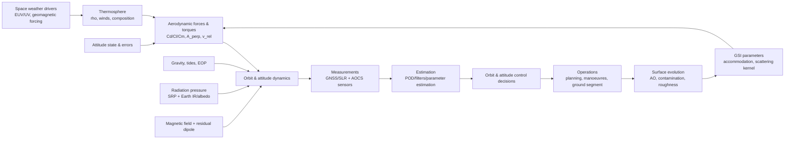

# Uncertainty Sources in Very Low Earth Orbit and Their Impacts on POD, Orbit Control, Mission Control, and Attitude Control

## Executive summary

Very Low Earth Orbit (VLEO) is commonly characterised (in mission and technology roadmapping) as the low-altitude regime below roughly 450 km, where aerodynamic effects become mission-defining rather than merely perturbative. citeturn11search3 In the 150–450 km band assumed here, **the largest and most operationally consequential uncertainties are almost always aerodynamic**, because (i) neutral density varies by orders of magnitude with altitude and space weather, and (ii) the *mapping* from ambient density to force/torque depends strongly (and often poorly) on rarefied gas–surface interaction physics, attitude, and surface evolution under atomic oxygen. citeturn25view1turn25view2turn27view0turn25view3turn43search12

Across the full end‑to‑end chain—**Precise Orbit Determination (POD)**, orbit prediction and control, mission planning, conjunction risk screening, and attitude determination/control—the uncertainty picture in VLEO can be framed as four coupled layers:

1. **Environmental drivers** (solar EUV/UV variability, geomagnetic forcing, tides/waves, composition changes) modulate density and winds on timescales from minutes to years. Storm-time thermospheric density enhancements can reach several hundred percent (and in extreme cases far more) at LEO/VLEO-relevant altitudes, directly amplifying drag and torque disturbances. citeturn37view2turn17search23turn0search2  
2. **Force/torque modelling** introduces epistemic uncertainty: the same measured orbit decay can be explained by different combinations of density, drag coefficient, and attitude-dependent projected area; similarly, aerodynamic torques depend on uncertain centres of pressure and gas-surface scattering parameters. Differences in drag‑coefficient modelling can reach “tens of percent” in derived densities in the upper thermosphere, because of gas–surface interaction assumptions. citeturn43search12turn43search0turn43search5  
3. **Spacecraft physical state** (attitude errors, temperature, surface roughness/contamination, atomic-oxygen erosion, mass properties, flexible appendage dynamics, propulsion alignment and noise) turns the environment into vehicle‑specific disturbances and biases that can leak into both orbit and attitude solutions. citeturn25view3turn9search1turn43search10turn45view0  
4. **Sensing, timing, estimation and operations** determine what is observable, what is estimated, and what becomes process noise or bias. GNSS carrier‑phase noise is typically at the mm‑level while code noise is at the dm‑to‑m level, but unmodelled dynamics (especially drag) dominates VLEO POD error budgets unless it is either directly measured (accelerometers) or robustly estimated with appropriate stochastic models and frequent tracking. citeturn38search12turn38search2turn40search15turn10search0

Mitigation strategies in VLEO accordingly cluster into: **(a) design** (low‑uncertainty aerodynamic geometry, controllable A/m, surface materials/coatings resistant to AO), **(b) estimation** (joint estimation of density/drag parameters; reduced‑dynamic POD and tuned process noise), and **(c) operations** (frequent orbit/attitude updates, robust manoeuvre execution monitoring, space‑weather‑aware planning). citeturn43search12turn12search0turn42search8turn42search12

Key open research questions are increasingly *cross-disciplinary*: rigorous **uncertainty quantification** that couples (i) thermosphere nowcasting/forecasting, (ii) rarefied/reactive gas–surface physics under AO exposure, and (iii) estimation/control co‑design for drag‑compensated or atmosphere‑breathing concepts. citeturn12search0turn43search10turn27view0turn12search4

## Scope and system-level view of VLEO uncertainty

VLEO missions operate where **neutral drag is not only the dominant non‑gravitational acceleration but also the dominant *uncertainty*** for orbit propagation at operational horizons (minutes to days). This is precisely why agency/industry definitions emphasise low‑altitude operation with “significantly increased drag”. citeturn11search3turn25view2turn12search0

A compact dynamical view useful for POD and control is:

\[
\dot{\mathbf{x}} = f(\mathbf{x},t;\,\boldsymbol{\theta}) + \mathbf{w}(t), \qquad 
\mathbf{y}_k = h(\mathbf{x}_k,t_k;\,\boldsymbol{\eta}) + \boldsymbol{\nu}_k
\]

where **\(\boldsymbol{\theta}\)** collects uncertain force‑model parameters (density scale factors, drag/lift coefficients, reflectivity coefficients, thrust scale factors, etc.), **\(\mathbf{w}\)** is unmodelled acceleration/torque (process noise), and **\(\boldsymbol{\nu}\)** is measurement noise/bias in tracking and attitude sensors. This separation aligns with standard batch least‑squares and Kalman filtering practice in orbit determination and in reduced‑dynamic approaches that absorb mismodelled dynamics with stochastic parameters or empirical accelerations. citeturn10search0turn10search1turn42search13

For VLEO, the canonical aerodynamic acceleration model is:

\[
\mathbf{a}_D = -\tfrac{1}{2}\,\rho\, C_D(\text{GSI},T_w,\text{composition})\,\frac{A_\perp(\mathbf{q})}{m}\,|\mathbf{v}_{rel}|\,\mathbf{v}_{rel}
\]

with **\(\rho\)** neutral density, **\(\mathbf{v}_{rel}\)** relative velocity including winds, **\(A_\perp(\mathbf{q})\)** projected area set by attitude \(\mathbf{q}\), and **\(C_D\)** a gas–surface‑dependent coefficient. That functional dependence is the heart of VLEO uncertainty: density, winds, composition, wall temperature, and scattering/accommodation parameters interact non‑linearly and evolve with AO exposure and contamination. citeturn37view2turn43search12turn27view0turn25view3

A useful practical distinction for VLEO missions is between:

- **Predictive uncertainty** (orbit prediction for planning and conjunction screening): driven by density forecast skill, assumed drag coefficient, and manoeuvre execution error. citeturn12search0turn3search3turn42search2  
- **Estimable uncertainty** (POD): portions of drag and sensor biases can be reduced via frequent tracking and parameter estimation, but separability is limited by strong parameter correlations (e.g., \(\rho\) vs \(C_D\) vs attitude). citeturn43search12turn10search1  
- **Control‑critical uncertainty** (attitude/orbit control stability margins): driven by torque disturbances (aerodynamic, magnetic), actuator limits, and sensor noise/bias. citeturn45view0turn43search10turn37view2

## Atmospheric environment and space weather

### Typical magnitudes in VLEO

**Neutral density:** Even under “mean reference atmosphere” conditions, density changes by ~3 orders of magnitude between 150 and 400 km. For example, a representative mean profile lists (order‑of‑magnitude) \(\rho \approx 1.8\times10^{-9}\,\mathrm{kg/m^3}\) at 150 km, \(\sim 2.1\times10^{-10}\) at 200 km, \(\sim 4.4\times10^{-12}\) at 300 km, and \(\sim 1.6\times10^{-12}\) at 400 km. citeturn25view1 Solar activity can shift these values substantially; tabulated low‑/high‑activity reference values show, e.g., at 400 km densities spanning \(\sim 2.9\times10^{-13}\) to \(1.5\times10^{-11}\,\mathrm{kg/m^3}\) across low/high activity and solar conditions in typical reference tables. citeturn25view2

**Aerodynamic acceleration (illustrative):** For a spacecraft with \(A/m = 0.02\,\mathrm{m^2/kg}\), \(C_D \approx 2.2\), \(v \approx 7.7\,\mathrm{km/s}\), the drag acceleration spans:
- \(\approx 1.7\times10^{-4}\) to \(6.7\times10^{-4}\,\mathrm{m/s^2}\) at 200 km for the representative density ranges above. citeturn25view2  
- \(\approx 6\times10^{-6}\) to \(2\times10^{-5}\,\mathrm{m/s^2}\) at 400 km for representative density ranges. citeturn25view1turn25view2  

Because \(\mathbf{a}_D \propto \rho\), **a 30% density (or effective ballistic coefficient) error produces a 30% drag‑acceleration error**, which translates rapidly into along‑track prediction error. Over one orbit (~5400 s), an unmodelled along‑track acceleration of \(10^{-6}\,\mathrm{m/s^2}\) yields a simple kinematic position error of ~15 m (\(\tfrac12 a t^2\)), illustrating why even “micro‑g”‑level mismodelling in drag‑dominated regimes is operationally significant. citeturn12search0turn10search1

**Thermospheric winds:** Winds enter primarily through \(\mathbf{v}_{rel} = \mathbf{v}_{orb} - \mathbf{v}_{wind}\). A widely cited compilation describes typical low‑latitude thermospheric winds of ~100–200 m/s, while high‑latitude winds during disturbed conditions can be ~1500 m/s or more, with rapid changes (minutes) in wind direction reported. citeturn37view0turn37view2 For VLEO, this implies that relative‑velocity magnitude and direction can have storm‑time perturbations of O(10%) in extreme cases, affecting both drag magnitude and cross‑track/lift components. citeturn37view2turn12search0

### Temporal and spatial variability and dominant timescales

The thermosphere/ionosphere system exhibits a hierarchy of variability, much of which maps directly onto VLEO orbit and attitude disturbances:

- **Minutes to hours:** gravity waves, travelling atmospheric disturbances, and storm‑time high‑latitude forcing can drive rapid changes in winds and density. Reported wind direction changes up to 180° on minute timescales are consistent with wave‑driven variability. citeturn37view2  
- **Diurnal and semidiurnal (~12–24 h):** migrating and non‑migrating tides modulate density and winds; representative semidiurnal wind tide amplitudes of tens of m/s and diurnal tide amplitudes ~O(50 m/s) at thermospheric altitudes are documented in standard environment references. citeturn37view2  
- **Days:** geomagnetic disturbance sequences and recovery phases; day‑to‑day upper ionosphere variability of ~10–30% is reported, reflecting transport and electrodynamic variability that also couples into neutral density and winds. citeturn37view4turn12search0  
- **27 days:** solar rotation modulates EUV and proxies (e.g., F10.7) used by density models. citeturn16search0turn12search0  
- **Seasonal:** annual/semiannual density variations and composition changes induce predictable but still uncertain long‑period behaviour. citeturn12search0turn25view2  
- **Solar cycle (~11 years):** baseline density scale height and temperature shift substantially, altering mean drag environment by up to orders of magnitude across 150–450 km. citeturn25view2turn12search0

### Modelling approaches and key uncertain parameters

Thermospheric density and wind modelling spans:

- **Empirical/semi‑empirical climatologies** driven by solar/geomagnetic indices (historically NRLMSISE‑type and DTM families). Updated versions (e.g., NRLMSIS 2.0) incorporate modern datasets and aim to improve performance, but uncertainty remains largest during storms and in poorly observed altitude bands. citeturn12search1turn20search16turn12search0  
- **Physics‑based general circulation models** (e.g., TIE‑GCM, GITM) that explicitly model coupled neutral/ion dynamics; they can represent storm physics more faithfully but remain sensitive to uncertain drivers, lower‑boundary forcing, and parameterisations, and often require data assimilation for operational accuracy. citeturn12search2turn12search3turn12search0  
- **Data‑assimilation drag models** (e.g., high-accuracy operational drag models) that ingest tracking/accelerometer-derived densities to update state estimates, significantly improving nowcasts compared to pure climatologies. citeturn3search3turn12search0  
- **Machine‑learning and hybrid approaches** increasingly target improved short‑term forecasting and uncertainty estimation, but robust generalisation across solar cycles and extreme storms remains a central challenge. citeturn12search4turn12search0

Key parameters and uncertainties (for POD and control) include:

- **\(\rho\) scaling and bias**: density model bias can be ~10–20% under quiet conditions but can become much larger during active conditions; storm‑time density changes of several hundred percent are explicitly reported, and extreme storms can produce much larger anomalies. citeturn17search23turn0search2turn12search0  
- **Composition and temperature**: mean molecular mass and species fractions influence both density and gas–surface interactions (affecting effective \(C_D\) and lift/torque). Composition variability (e.g., O/N2 changes) is a recognised driver of thermospheric density structure and storm response. citeturn12search1turn12search0turn42search1  
- **Winds**: uncertain and spatially heterogeneous; high-latitude coupling to interplanetary magnetic field and geomagnetic activity is explicitly documented. citeturn37view4turn37view2  
- **Small‑scale structure**: unresolved waves create “coloured” density fluctuations that cannot be captured by coarse models; for estimation, this becomes process noise with non‑white characteristics unless explicitly modelled. citeturn37view2turn10search0

### Impact pathways and mitigations

**Impact on POD:** Drag mismodelling primarily corrupts along‑track dynamics, which then couples into radial via orbital geometry and estimation correlations. Reduced‑dynamic POD—including stochastic accelerations or piecewise constant empirical accelerations—explicitly exists to absorb such mismodelling; however, it can mask physical parameters (e.g., density vs \(C_D\)). citeturn10search1turn43search12

**Impact on orbit control and mission control:** Density forecast errors propagate into:
- **Station‑keeping and drag‑makeup Δv** computation errors (under/over‑compensation),  
- **Prediction of reboost windows and lifetime margins**, and  
- **Conjunction assessment**: uncertainty in along‑track prediction increases encounter-plane uncertainty, affecting screening thresholds and manoeuvre decisions. citeturn3search3turn42search2turn12search0

**Impact on attitude control:** Aerodynamic torques can dominate disturbance torques in VLEO for high \(A/m\) vehicles, especially with large lever arms between centre of pressure and centre of mass; uncertainty in winds, density and gas–surface interaction directly becomes uncertainty in torque. citeturn37view2turn43search10turn27view0

**Mitigations:**
- **Design:** minimise attitude‑sensitive \(A_\perp\) variation; use symmetric aeroshapes or controlled aerodynamic surfaces; increase mass (reduce \(A/m\)) where feasible. citeturn43search18turn43search14  
- **Operational:** frequent orbit updates; space‑weather‑aware planning; tactical manoeuvre margins during predicted storms. citeturn12search0turn16search0  
- **Estimation/filtering:** estimate drag scale factors, \(C_D\) parameters, or directly estimate density; tune process noise to match observed residuals; use accelerometers where feasible to separate density from drag‑coefficient uncertainty. citeturn17search3turn10search1turn43search12  

Open questions include how to provide **reliable probabilistic density forecasts** for operational windows (hours–days) and how to represent small‑scale variability and storm extremes in uncertainty‑aware orbit prediction. citeturn12search0turn12search4

## Non-atmospheric perturbations and geophysical models

Although drag typically dominates non‑gravitational acceleration in VLEO, other forces and modelling errors matter for high‑precision POD, long arcs, attitude dynamics, and bias separation—especially when accelerometers or reduced‑dynamic models convert some forces into estimated parameters.

### Gravity field, tides, and Earth orientation

**Static geopotential:** High‑order spherical harmonic gravity is essential in LEO/VLEO because short spatial wavelengths are dynamically “felt” more strongly at low altitude. State‑of‑practice gravity models such as EGM2008 provide coefficients to very high degree and order. citeturn5search5

**Time‑variable gravity:** Solid Earth tides, ocean tides, pole tide, and related loading effects perturb the gravity potential; their modelling is standardised in the IERS Conventions, which are foundational for precise orbit modelling, reference frames, and time transformations in space geodesy and high‑precision POD. citeturn5search0

**Uncertainty character:** For most modern LEO POD, residual gravity‑field and tide‑model errors are usually smaller than unmodelled drag but can dominate **radial orbit error** for certain mission types (e.g., altimetry) if gravity/tides are not handled consistently. citeturn42search1turn5search0

**Mitigation:** adopt IERS‑consistent models, maintain consistent reference frames and Earth orientation parameters, and validate orbit residuals against independent tracking types (SLR vs GNSS) to expose modelling inconsistencies. citeturn5search0turn38search3turn10search1

### Third-body perturbations

Third-body solar and lunar perturbations are well modelled, and ephemerides such as modern JPL DE series quantify high accuracy in planetary/lunar positions. citeturn14search4 In LEO, the characteristic magnitude of lunar/solar third‑body accelerations is on the order of \(10^{-7}\)–\(10^{-6}\,\mathrm{m/s^2}\) (tidal term), far smaller than VLEO drag but not negligible for precision modelling over long arcs. citeturn14search2turn14search4

Uncertainty in third‑body modelling is generally a second‑order effect compared with drag, but becomes relevant when attempting to isolate small accelerations (e.g., radiation pressure calibration or accelerometer bias), or when measurement noise is very low. citeturn10search1turn17search3

### Radiation pressure: direct solar, Earth albedo, thermal re-radiation

**Direct solar radiation pressure (SRP):** A standard near‑Earth SRP model uses a nominal pressure at 1 AU of \(K \approx 4.56\times10^{-6}\,\mathrm{N/m^2}\) with a reflectivity coefficient \(C_R\) to capture absorption/scattering. citeturn31view0 The corresponding acceleration scale is:

\[
a_{SRP}\approx K\,C_R\,\frac{A}{m}
\]

For \(A/m = 0.02\,\mathrm{m^2/kg}\) and \(C_R\approx 1.3\), \(a_{SRP}\approx 1.2\times10^{-7}\,\mathrm{m/s^2}\), typically 1–3 orders of magnitude smaller than VLEO drag but relevant for separating small biases and for attitude torque on large areas. citeturn31view0turn10search1

**Earth radiation pressure (ERP):** Earth’s outgoing longwave radiation (OLR) has a representative global mean of ~238 W/m², with regional standard deviation ~17 W/m² (and even larger local variability). citeturn34view0 This supports a back‑of‑the‑envelope pressure scale of \(p \sim \mathrm{flux}/c\sim 10^{-6}\,\mathrm{N/m^2}\), i.e., a non‑negligible fraction of SRP. citeturn34view0turn31view0 A classical statement in orbit modelling literature is that, at ~200–300 km altitudes, **Earth radiation pressure can reach ~35% of direct solar pressure**, emphasising its potential relevance in VLEO. citeturn36search0 Modern modelling increasingly uses CERES-driven, time‑varying Earth radiation datasets and forward/inverse estimation of ERP to reduce systematic errors in LEO POD. citeturn33search2turn32view0

**Uncertainty drivers:** surface optical properties (aging, contamination), eclipse modelling, Earth reflectance spatial/seasonal variability, and simplified Lambertian assumptions. These uncertainties primarily affect POD through mismodelled along‑track and cross‑track accelerations, and affect attitude control through torques about the centre of mass for asymmetric geometries. citeturn33search2turn32view0turn10search1

### Magnetic field modelling and magnetic torques

Earth’s main field is typically represented by models such as the International Geomagnetic Reference Field (IGRF), maintained under entity["organization","IAGA","geomagnetism association"], with periodic updates. citeturn15search9turn5search10 In LEO/VLEO, magnetic torques arise from:

\[
\mathbf{T}_{mag} = \mathbf{M}\times \mathbf{B}
\]

where \(\mathbf{M}\) is spacecraft residual magnetic dipole moment and \(\mathbf{B}\) the local geomagnetic flux density. citeturn45view0 A classic disturbance-torque reference notes that careful magnetic cleanliness and compensation can reduce residual dipole moments to ~0.05–0.10 A·m² for small spacecraft, and provides dipole-moment-per-mass sizing factors for different magnetic cleanliness classes. citeturn45view0

**Typical magnitude (illustrative):** with \(|M|=0.1\,\mathrm{A\,m^2}\) and \(|B|=30\,\mu\mathrm{T}\), \(|T|\sim 3\times 10^{-6}\,\mathrm{N\,m}\), which can be a dominant torque for small satellites with small inertia. citeturn45view0turn15search9

**Uncertainties:** residual dipole knowledge error, magnetic hysteresis/induced magnetism, onboard current-loop variability, and storm‑time external field disturbances not represented by the main-field model alone. citeturn45view0turn5search10

**Impact pathways:** primarily attitude control (reaction wheel saturation, magnetorquer authority, safe‑mode pointing) and secondarily POD when attitude errors feed back into aerodynamic/RP modelling. citeturn45view0turn43search12turn37view2

## Spacecraft physical properties and actuators

### Rarefied aerodynamics and gas–surface interactions

VLEO sits largely in **transition to free‑molecular flow** (depending on characteristic length scale). A DSMC-oriented discussion identifies regimes by Knudsen number \(Kn=\lambda/L_c\): transitional \(0.1\le Kn \le 10\), free molecular \(Kn>10\). citeturn27view0 For \(L_c=1\,\mathrm{m}\), mean free paths in the 130–260 km band can range from ~O(1 m) to O(10³ m), implying \(Kn\sim 1\)–10³ and thus strong rarefied‑flow sensitivity of coefficients to gas–surface physics and geometry. citeturn27view0

**Modelling approaches for aerodynamic coefficients:**
- **Analytical free‑molecular models** (e.g., Maxwell/Sentman‑type) for simple geometries, parameterised by accommodation coefficients and reflection models. citeturn27view2turn43search6  
- **Panel methods** for complex spacecraft in free molecular flow, trading fidelity for speed (useful for design loops and estimation). citeturn43search14turn43search25  
- **TPMC/DSMC** for high-fidelity modelling with complex scattering kernels, at high computational cost. citeturn27view0turn3search0  
- **Response surface / Gaussian-process surrogate models** trained on TPMC to enable fast evaluation in orbit determination and Monte‑Carlo UQ. citeturn43search11turn43search2  

**Key uncertain parameters:**
- **Energy and momentum accommodation coefficients:** in‑orbit measurements show variability with altitude; one study reports accommodation coefficients near 0.99–1.00 around 200 km and ~0.88 near 320 km, illustrating non‑constancy across VLEO. citeturn43search5  
- **Scattering kernel choice (Maxwell vs Cercignani‑Lampis variants, etc.)** and incident-angle dependence, which modern VLEO-focused models explicitly attempt to capture. citeturn27view2turn43search10  
- **Surface composition/roughness/contamination:** these modify accommodation and scattering, and therefore affect both \(C_D\) and torque coefficients. citeturn43search3turn3search0turn43search22  

**Quantified consequences:** Differences in drag‑coefficient modelling can produce “tens of percent” differences in derived densities in the upper thermosphere, dominated by gas–surface interaction differences under some conditions. citeturn43search12 In a closely related context, modelling drag coefficients with diffuse GSI assumptions has been reported to potentially lead to ~25% errors in derived density and corresponding in‑track orbit prediction errors for thermosphere observations—highlighting the density–\(C_D\) identifiability problem. citeturn43search0turn43search8

### Aerodynamic torques, attitude coupling, and control authority

Aerodynamic torque scales with dynamic pressure \(q=\tfrac12\rho v^2\), reference area, and a lever arm (centre of pressure offset). Because \(\rho\) and winds vary strongly in VLEO, aerodynamic torque is often the dominant disturbance torque, and its uncertainty is driven by:
- wind uncertainty and variability (directional torque changes), citeturn37view2  
- attitude errors and structural alignment drift (changing \(A_\perp\) and centre of pressure), citeturn8search4  
- surface temperature and accommodation coefficient evolution. citeturn27view2turn43search5turn25view3

Mitigations include aerodynamic‑torque‑robust AOCS design (sufficient control authority, disturbance observers), deliberate aerodynamic shaping to align centre of pressure and centre of mass, or exploit aerodynamic control surfaces to generate controlled lift/drag moments. citeturn43search18turn43search14

### Atomic oxygen, material erosion, and surface evolution

Atomic oxygen (AO) is a key VLEO‑specific mechanism: AO impingement erodes many polymers and coatings, changes surface roughness and chemistry, and thereby changes both optical properties (radiation pressure, thermal balance) and gas–surface interaction parameters (drag and torque coefficients). citeturn25view3turn6search11 AO flux levels at ~400 km are commonly quoted around \( \sim 8\times10^{14}\,\mathrm{atoms/cm^2/s}\) (order of magnitude) for ram exposure, and integrated fluence can be mission‑limiting for unprotected materials. citeturn0search2turn25view3

**Impact pathways:**
- **POD/orbit control:** gradual changes in effective \(C_D\) and \(A_\perp\) (through roughness and geometry changes) manifest as time‑varying ballistic coefficient bias. citeturn43search12turn25view3  
- **Attitude control:** evolving centre of pressure and torque coefficients; changing optical properties also modifies SRP/ERP torque constants. citeturn25view3turn33search2turn31view0  
- **Mission control:** lifetime predictions and drag‑makeup propellant budgets drift as surfaces age, requiring recalibration. citeturn12search0turn43search12

Mitigation strategies include AO‑resistant coatings/material choices, contamination control, periodic in‑flight recalibration of drag coefficient parameters, and geometry choices that reduce sensitivity to surface condition. citeturn6search11turn43search12turn9search1

### Charging and plasma interactions

VLEO traverses the ionosphere/plasma environment where spacecraft can accumulate charge, experience differential charging, and interact with plasma flows. citeturn5search8turn5search12 Beyond electrical risks, plasma interaction can also modify the effective aerodynamic force (“plasma drag”) or enable concepts such as charged or “Coulomb” aerodynamics, though this remains an active research area in terms of practical control authority and modelling uncertainty. citeturn2search4turn5search8

Charging uncertainties affect:
- **Attitude sensors** (e.g., star tracker blinding from discharges, sensor noise), citeturn5search8turn7search9  
- **AOCS actuators** (magnetorquer interactions, arcing risks), citeturn5search12turn45view0  
- **POD indirectly** via attitude‑dependent drag and measurement interruptions. citeturn43search12turn10search1

### Structure, thermal deformation, outgassing, and mass properties

**Thermal deformation and flexing** introduce time‑varying alignment errors between sensors (GNSS antenna phase centres, star trackers) and the spacecraft body frame, as well as inertia tensor drift that changes attitude dynamics. Thermal misalignment is a documented contributor to star‑tracker direction errors and bias. citeturn8search4turn36search6

**Outgassing** contributes to contamination films on optical and aerodynamic surfaces and can change both optical coefficients and gas–surface interactions; outgassing control is formalised through databases and test standards (e.g., TML/CVCM screening). citeturn9search1turn9search12

**Mass properties** evolve with propellant consumption and can be uncertain due to fuel gauging errors; this impacts attitude control via inertia modelling and orbit control via Δv calibration. citeturn42search12turn10search1

### Propulsion and thrust uncertainties

In VLEO, propulsion is frequently used for drag makeup (or continuous compensation). Thrust uncertainties arise from:
- **Magnitude/scale factor error** (calibration, plume interactions),  
- **Direction/misalignment** (mounting tolerances, thermal distortion), and  
- **Noise/thrust ripple** (especially for low‑thrust/electric systems), which can leak into accelerometer calibration and POD residuals if not modelled. citeturn3search0turn17search3turn42search13

Cold‑gas and low‑thrust system analyses commonly treat misalignment and acquisition errors as key contributors to manoeuvre execution uncertainty, requiring onboard estimation and/or ground-based orbit determination to close the loop. citeturn8search12turn10search1

Mitigation relies on: thrust calibration manoeuvres, estimation of effective thrust vectors, closed-loop guidance with frequent navigation updates, and robust fault detection/isolation in the control chain. citeturn42search12turn42search13turn10search1

## Tracking data, timing, estimation and software

### Tracking sensors and typical measurement magnitudes

**GNSS (spaceborne):** GNSS-based POD is a workhorse for LEO missions; high-quality dual-frequency measurements in LEO are achievable with both dedicated and adapted receivers, enabling robust code and carrier-phase observations under high dynamics. citeturn38search1turn40search15 For observation noise, a common order-of-magnitude benchmark is **carrier phase at the mm level** (e.g., 2–3 mm) and **code at the dm–m level** (often ~0.3 m for common modelling assumptions, though receiver-dependent). citeturn38search12turn38search4 Real-time LEO POD studies using single-frequency receivers explicitly assume code noises ~0.6 m and phase noises ~1 mm, consistent with these magnitudes. citeturn38search9

**SLR:** Satellite Laser Ranging can provide mm‑level normal point precision (often quoted ~1–2 mm), making it a powerful independent validation tool for GNSS-derived or dynamically integrated orbits. citeturn38search3turn38search15

**Attitude sensors:** Star tracker performance for “high-accuracy” assemblies is typically discussed in arcsecond-class accuracy regimes in the spacecraft attitude-determination literature, with calibration and thermal behaviour as key error sources. citeturn7search7turn7search9turn8search4 Magnetometer accuracy is limited by bias/scale factor and spacecraft magnetic cleanliness, and requires calibration strategies to maintain attitude-determination performance. citeturn8search0turn45view0

### Timing and clock errors

Clock and timing errors map directly into range errors (via \(c\,\Delta t\)) and into carrier phase ambiguities and filter stability. The entity["organization","International GNSS Service","global geodesy service"] products guide explicitly notes GNSS receiver clock estimates at ~0.03 ns precision in high-grade processing, corresponding to a ~9 mm light‑time range scale. citeturn38search2 In real‑time onboard processing, clock–ambiguity correlations can become a limiting factor for time synchronisation and navigation accuracy without augmentation. citeturn38search13turn42search13

### Media effects: ionosphere and scintillation

Even though a LEO receiver is above the neutral atmosphere, GNSS signals traverse the ionosphere/plasmasphere, making ionospheric delay and scintillation key uncertainty sources. The first‑order ionospheric group delay is proportional to TEC and inversely proportional to \(f^2\), with the conventional constant \(40.3\) (in SI‑consistent forms) appearing in standard derivations. citeturn6search3turn6search4 Dual-frequency combinations mitigate first-order ionospheric delay, but residual higher-order terms, scintillation-driven tracking losses, and receiver-specific biases remain relevant, especially under geomagnetic disturbance conditions that also coincide with peak drag uncertainty. citeturn6search0turn5search8turn12search0

### Modelling error, parameter estimation, and filter design

In VLEO, **the modelling error in non‑conservative forces is often the dominant error source**, so estimation strategies become part of the “uncertainty budget”:

- **Reduced-dynamic POD** estimates stochastic accelerations in one or more directions to absorb drag and other mismodelled accelerations, improving orbit fit but reducing physical interpretability. citeturn10search1turn10search0  
- **Consider parameter and batch/sequential estimation** frameworks manage parameter correlations (e.g., density scale vs \(C_D\) vs attitude) and allow incorporation of a priori uncertainties. citeturn10search1turn43search12  
- **Process noise modelling** is essential: unmodelled density fluctuations and attitude‑drag coupling create coloured acceleration noise, and filter tuning strongly affects both POD stability and control deadbands. citeturn10search0turn42search13turn12search0  

Operational orbit determination analyses (e.g., for human spaceflight contexts) show that practical navigation solutions can exhibit along‑track biases and heteroscedastic errors, motivating realistic weighting and stochastic modelling rather than purely “spec-sheet” noise assumptions. citeturn42search5turn10search0

### Operational uncertainties, software, and human factors

Even with perfect physics models, real systems are constrained by operational realities: ground station visibility, tracking geometry, data latency, configuration management, command sequencing errors, and software faults.

A mission operations best‑practices report notes that many errors reaching the spacecraft can be generated by the mission operations process or allowed to pass through it; commanding and operations errors can directly affect mission goal accomplishment. citeturn42search8 Mission assurance guidance for satellite operations is commonly structured around prevention and recovery, emphasising disciplined processes, verification, and contingency handling. citeturn42search12

Modern surveys of space system anomalies and software failures highlight that software faults can be mission-critical, and cyber/space anomaly detection is an expanding discipline relevant to protecting the integrity of navigation and control loops. citeturn42search10turn42search4

For VLEO specifically, the operational coupling is acute: space‑weather events simultaneously degrade drag predictability and can degrade communications and GNSS tracking robustness, increasing both process noise and measurement outages at the same time. citeturn12search0turn5search8turn17search23

## Taxonomy of VLEO uncertainty sources and research gaps

### Conceptual uncertainty-propagation diagram

### Taxonomy table

| Uncertainty source | Physical mechanism and key uncertain parameters | Dominant variability scales | Typical magnitude in 150–450 km (order-of-magnitude) | Primary impacts and mitigations |
|---|---|---|---|---|
| Neutral density \(\rho\) (mean + variability) | Thermospheric temperature/composition; EUV heating; storm-time expansion; density model bias/scale factors | minutes → solar cycle | \(\rho \sim 10^{-9}\) kg/m³ at 150 km down to \(\sim 10^{-12}\) kg/m³ at 400 km; storm-time changes of O(100%) or more | POD along-track errors; orbit prediction/lifetime; drag makeup Δv. Mitigate via assimilation/nowcasting, frequent OD updates, density/drag estimation. citeturn25view1turn25view2turn17search23turn12search0 |
| Thermospheric winds | Relative-velocity uncertainty; high-latitude forcing tied to IMF/geomagnetic activity | minutes → hours | ~100–200 m/s low lat; up to ~1500 m/s or more high lat disturbed | Drag magnitude/direction; aerodynamic torque; cross-track lift effects. Mitigate via wind-aware models, process noise, robust AOCS margins. citeturn37view2turn37view0 |
| Composition variability | O/N2, mean molecular mass; affects density and GSI | hours → seasonal | induces density and \(C_D\) shifts (tens of %) in derived parameters | Parameter correlation \(\rho\) vs \(C_D\); improves with physics-based/assimilative models + accelerometers. citeturn12search1turn43search12turn17search3 |
| Rarefied flow regime (Kn) | Mean free path \(\lambda\) uncertain via density/composition; regime selection | altitude-dependent | \(\lambda\sim 1\)–\(10^3\) m at 130–260 km (illustrative); \(Kn\sim 1\)–\(10^3\) for \(L_c=1\) m | Drives model-form uncertainty (free-molecular vs transitional). Mitigate via TPMC/DSMC where needed; surrogate models for operations. citeturn27view0turn43search11 |
| Gas–surface interaction (GSI) & accommodation | Scattering kernel choice; \(\alpha_{acc}\) angle/temperature dependence; wall temperature | slow drift + attitude changes | Differences can cause “tens of %” density/drag differences; measured accommodation coefficients vary with altitude | Bias in POD and density inference; AOCS torque mismatch. Mitigate via in-orbit calibration, response surfaces, updated GSI models. citeturn43search12turn43search5turn43search10turn43search0 |
| Atomic oxygen (AO) degradation | Erosion/oxidation; roughness/chemistry change; contamination film evolution | cumulative → mission life | AO flux O(\(10^{14}\) atoms/cm²/s) at ~400 km (ram) | Time-varying \(C_D\), optical properties, torque coefficients; lifetime and thermal shifts. Mitigate via coatings/materials, contamination control, periodic recalibration. citeturn25view3turn6search11turn0search2 |
| Plasma interactions & charging | Differential charging; arcing; plasma drag/interaction forces | seconds → storms | primarily qualitative in VLEO ops; can induce measurement dropouts and hazards | AOCS disturbances, sensor anomalies; indirect POD outages. Mitigate via charging design guidelines, monitoring, safe modes. citeturn5search8turn2search4 |
| SRP | Photon momentum transfer; \(C_R\) and geometry unknown; eclipse modelling | orbit-period + seasonal | \(K\approx 4.56\times10^{-6}\,\mathrm{N/m^2}\) at 1 AU; \(a_{SRP}\sim 10^{-8}\)–\(10^{-7}\,\mathrm{m/s^2}\) for typical \(A/m\) | Small in VLEO vs drag but relevant for bias separation and torques. Mitigate via \(C_R\) estimation and geometry models. citeturn31view0turn10search1 |
| Earth IR/albedo (ERP) | Earth OLR/albedo spatial and seasonal variability; reflectance models | hours → seasonal | global mean OLR ~238 W/m²; ERP can be substantial fraction of SRP at VLEO | Along-track/cross-track accelerations; thermal loads; attitude torques. Mitigate with CERES-based models and parameter estimation. citeturn34view0turn36search0turn33search2turn32view0 |
| Gravity field & tides | High-degree geopotential; time-variable tides/loading; EOP consistency | hours → seasonal/decadal | accelerations large but well-modelled; **uncertainty** mission-dependent | Radial/orbit consistency, especially for geodetic missions. Mitigate using IERS conventions, updated gravity models, multi-tech tracking validation. citeturn5search0turn5search5turn42search1turn38search3 |
| Third-body | Sun/Moon perturbations; ephemeris accuracy | days → years | \(10^{-7}\)–\(10^{-6}\,\mathrm{m/s^2}\) scale (tidal term) | Usually small vs drag; relevant in precision residuals. Mitigate via standard ephemerides and consistent frames. citeturn14search4turn14search2turn10search1 |
| Magnetic torque | \(\mathbf{T}=\mathbf{M}\times\mathbf{B}\); residual dipole uncertainty; storm-time external fields | orbit-period + storms | residual \(M\sim 0.05\)–0.10 A·m² achievable; torque can be μN·m scale | AOCS load and pointing jitter; couples to drag modelling via attitude. Mitigate via magnetic cleanliness, calibration, robust control. citeturn45view0turn15search9turn5search10 |
| GNSS tracking errors | Multipath, antenna PCV, ionosphere residuals, clock errors, outages | seconds → days | phase ~mm; code ~dm–m; receiver clocks ~0.03 ns in high-grade processing | POD quality, especially when dynamics mismodelled. Mitigate via dual-frequency, robust tracking, modelling conventions, multi-GNSS. citeturn38search12turn38search2turn38search9turn40search15 |
| SLR tracking errors | Timing drifts, troposphere delay, station biases | seconds → years | normal point precision ~mm | Orbit validation and absolute scale; mitigate via calibration and ILRS QC. citeturn38search3turn38search15 |
| Attitude sensor errors | Star tracker calibration/thermal misalignment; magnetometer bias/scale; gyro drift | seconds → months | arcsecond-class attitude errors for high-grade star trackers (mission-dependent) | Affects drag/RP modelling and pointing; mitigate with calibration, thermal control, sensor fusion. citeturn8search4turn7search7turn8search0 |
| Propulsion execution | Thrust scale, misalignment, timing; manoeuvre modelling | seconds → operations | mission-dependent; errors map to Δv vector error | Orbit control, conjunction avoidance; mitigate via orbit determination feedback and thrust calibration. citeturn42search2turn10search1turn42search12 |
| Ground/ops/software & human factors | Commanding errors, configuration drift, software faults, data latency | events → lifecycle | not altitude-specific | Can dominate failure risk and cause large OD/control errors. Mitigate via mission assurance processes, verification, anomaly detection, robust ops procedures. citeturn42search8turn42search12turn42search10turn42search4 |

### Open research gaps specific to VLEO uncertainty

1. **Joint thermosphere–aerodynamics UQ:** Density is not directly observable from orbit decay without assumptions on \(C_D\) and attitude; conversely \(C_D\) inference depends on density. Modern reviews explicitly highlight “tens of percent” differences due to GSI/drag‑coefficient modelling choices, implying that UQ must treat \(\rho\) and \(C_D\) together rather than separately. citeturn43search12turn43search0turn12search0  
2. **Reactive and evolving surfaces:** VLEO‑tailored gas–surface models increasingly incorporate incident-angle‑dependent accommodation and energy transfer, but validating these in orbit under AO and contamination exposure remains an open challenge for both physics and operations. citeturn43search10turn25view3turn6search11  
3. **Storm-resilient probabilistic orbit prediction:** extreme geomagnetic storms can drive density increases of several hundred percent (or more), and these events coincide with outages in tracking/communications and elevated operational risk; robust probabilistic prediction for conjunction screening is not yet “solved.” citeturn17search23turn5search8turn12search0  
4. **Estimation/control co-design:** drag‑compensation and atmosphere‑breathing or highly drag‑sensitive missions require that the navigation filter and the controller be designed together, so that density estimation, thrust calibration, and attitude control do not destabilise each other through shared uncertainties. citeturn27view0turn42search13turn12search0  
5. **Operational standards translated into quantitative uncertainty budgets:** mission assurance and operations guidance exists, but translating it into quantitative, closed-loop uncertainty budgets (including human/software error modes) for VLEO autonomy is still emerging. citeturn42search8turn42search12turn42search10