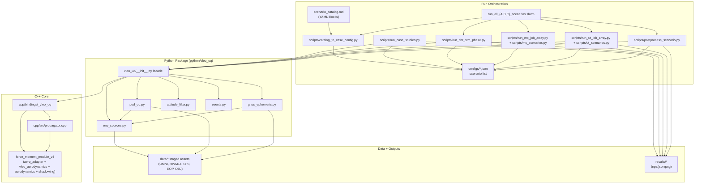
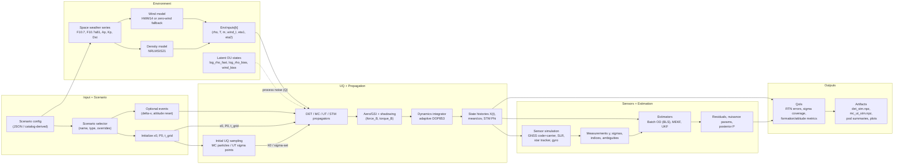

# VLEO_UQ Architecture

## 1) Overview

This repository is a mixed **Python + C++** scientific stack for VLEO mission simulation and uncertainty analysis:

- **C++ core** handles orbit-attitude propagation and aerodynamic force/torque evaluation.
- **Python package (`vleo_uq`)** wraps the C++ core, builds environment time series, simulates measurements, and runs estimation/UQ workflows.
- **Scripts + SLURM pipelines** orchestrate scenario generation, distributed MC/UT runs, postprocessing, and POD metrics.

Primary modeled flow is:

`config -> scenario -> UQ sampling (MC/UT/STM) -> propagation -> aero forces/torques -> measurement simulation -> estimation -> outputs`

Canonical references for frozen definitions:

- `docs/state_and_coupling.md` for the 18-state ordering, units, frames, and coupling equations.
- `docs/decision_log.md` for baseline decisions (state definition, GSI baseline, POD estimator baseline, truth definition).

## 2) Repo Survey

### Languages and build/runtime layers

- **Python**: orchestration, UQ drivers, measurement simulation, estimation, environment data ingestion.
- **C++17 (pybind11 + Eigen)**: propagators, force/torque coupling, aerodynamic geometry/shadowing/GSI-like model.
- **Bash/SLURM**: multi-node orchestration (`run_all_A/B/C_scenarios.slurm`, MPI/job-array launch scripts).
- **JSON + Markdown/YAML blocks**: scenario configuration.

### Main entrypoints

- Single-process scenario run: `scripts/run_case_studies.py`
- Phase-1 deterministic/STM-only run: `scripts/run_det_stm_phase.py`
- Distributed MC shard runner: `scripts/run_mc_job_array.py`
- Distributed UT shard runner: `scripts/run_ut_job_array.py`
- Phase-2 merge/postprocess/POD: `scripts/postprocess_scenario.py`, `scripts/postprocess_uq_pod.py`
- Catalog conversion (`scenario_id` -> runtime config): `scripts/catalog_to_case_config.py`
- Full cluster pipelines: `run_all_A_scenarios.slurm`, `run_all_B_scenarios.slurm`, `run_all_C_scenarios.slurm`

### Concise project tree (depth 3-4)

```text
VLEO_UQ/
├─ python/vleo_uq/                               [CORE]
│  ├─ __init__.py                                facade/API export
│  ├─ pod_uq.py                                  measurement models + batch OD + POD UQ
│  ├─ env_sources.py                             space-weather parsing + density/wind coupling
│  ├─ gnss_ephemeris.py                          SP3/EOP parsing + frame/time transforms
│  ├─ attitude_filter.py                         MEKF/UKF attitude + fullstate filters
│  ├─ attitude_uq.py                             attitude error process + mapping utilities
│  └─ events.py                                  discrete event injection utilities
├─ cpp/                                          [CORE]
│  ├─ include/vleo/propagator.hpp                propagator interfaces
│  ├─ src/propagator.cpp                         DET/MC/UT/STM dynamics engine
│  └─ bindings/bindings.cpp                      pybind11 module `_vleo_uq`
├─ force_moment_module_v4/                       [CORE]
│  ├─ include/                                   aero/shadowing/config APIs
│  └─ src/                                       aero adapter + GSI-like pressure model + shadowing
├─ scripts/                                      [CORE orchestration + UTIL]
│  ├─ run_case_studies.py                        monolithic pipeline (DET+MC+UT+STM+optional POD)
│  ├─ run_det_stm_phase.py                       phase-1 deterministic/STM
│  ├─ run_mc_job_array.py / run_ut_job_array.py  distributed UQ shards
│  ├─ mc_scenarios.py / ut_scenarios.py          shard scenario factories
│  ├─ postprocess_scenario.py                    phase-2 merge + plotting + POD
│  ├─ postprocess_uq_pod.py                      POD postprocessing internals
│  └─ catalog_to_case_config.py                  scenario_catalog -> JSON config converter
├─ configs/                                      [CORE config]
│  └─ case_studies*.json                         runtime scenario configs
├─ run_all_A_scenarios.slurm                     [CORE pipeline: ATT]
├─ run_all_B_scenarios.slurm                     [CORE pipeline: FORM]
├─ run_all_C_scenarios.slurm                     [CORE pipeline: OD]
├─ scenario_catalog.md                           [CORE scenario definitions, YAML blocks]
├─ tests/                                        [TEST]
└─ data/                                         [DATA assets: OMNI, HWM14, SP3, EOP, OBJ]
```

### Config formats and scenario selection

- Runtime scenarios are **JSON** (`configs/case_studies*.json`) with `scenarios: [...]` entries.
- Research catalog lives in **Markdown with YAML code blocks** (`scenario_catalog.md`).
- `scripts/catalog_to_case_config.py` extracts YAML blocks, maps `scenario_id` to lowercase runtime `name`, maps `area` -> `type` (`ATT -> attitude`, `FORM -> formation`, `OD -> mission`), and writes JSON.
- `scenario_id` selection is done by:
  - `--ids` in `scripts/catalog_to_case_config.py`
  - prefix filters in SLURM scripts (e.g., `ATT_A*`, `FORM_B*`, `OD_C*`) before conversion.
- Runtime scenario selection is by `name` (`--scenario` in `scripts/run_det_stm_phase.py` / `scripts/postprocess_scenario.py`) or by env vars in shard runners (`VLEO_CASE_NAME`, `VLEO_CASE_CONFIG`).

## 3) High-Level Module/Package Dependencies

### Mermaid diagram (module/package view)



Diagram source file: `docs/diagrams/module_dependencies.mmd`

### Static dependency extraction notes

- Python import graph was extracted by AST parsing of `python/` and `scripts/`.
- C++ include graph was extracted from `cpp/` and `force_moment_module_v4/` headers/sources.
- Because many scripts import via `from vleo_uq import ...`, submodule coupling is partially flattened at package level.
- Some orchestration edges (e.g., SLURM -> scenario factories) are inferred from CLI args/environment variable usage.

### Top central modules/files (fan-in/fan-out, approximate)

| Rank | Module/file | Fan-in | Fan-out | Notes |
|---|---|---:|---:|---|
| 1 | `vleo_uq` | 14 | 0 | Python package facade imported broadly |
| 2 | `scripts.run_case_studies` | 5 | 3 | Main orchestration hub |
| 3 | `force_moment_module_v4/include/aero_adapter.h` | 3 | 2 | Core aero adapter interface |
| 4 | `force_moment_module_v4/include/vleo_aerodynamics.h` | 3 | 2 | Aero core API boundary |
| 5 | `vleo_uq.env_sources` | 3 | 1 | Env/time/weather hub |
| 6 | `force_moment_module_v4/include/body_importer.h` | 3 | 1 | Geometry import dependency |
| 7 | `cpp/include/vleo/propagator.hpp` | 2 | 1 | Propagator API root |
| 8 | `cpp/bindings/bindings.cpp` | 0 | 3 | Python/C++ binding hub |
| 9 | `force_moment_module_v4/src/vleo_aerodynamics.cpp` | 0 | 3 | Aero assembly/shadowing path |
| 10 | `scripts.postprocess_uq_pod` | 1 | 2 | Phase-2 POD pipeline core |
| 11 | `force_moment_module_v4/include/env_config.h` | 3 | 0 | Shared geometry/env defaults |
| 12 | `force_moment_module_v4/include/smu_stubs.h` | 3 | 0 | Shared transform API |
| 13 | `scripts.mc_scenarios` | 0 | 2 | MC scenario factory bridge |
| 14 | `scripts.ut_scenarios` | 0 | 2 | UT scenario factory bridge |
| 15 | `scripts.run_det_stm_phase` | 0 | 2 | Phase-1 deterministic/STM runner |

## 4) Runtime/Dataflow Reconstruction

### Mermaid diagram (runtime pipeline)



Diagram source file: `docs/diagrams/runtime_dataflow.mmd`

## 5) Python/C++ Boundary And Threading Guarantees

### 5.1 Boundary contract (no Python callback in inner propagation loops)

- Python orchestration (`scripts/run_case_studies.py`, `scripts/run_det_stm_phase.py`) builds:
  - `t_grid` as a dense numeric array,
  - `env` as a concrete `std::vector<EnvInputs>` passed through pybind11.
- C++ propagators (`DeterministicPropagator`, `EnsemblePropagatorMC`, `SigmaPointPropagatorUT`, `StmPropagator`)
  execute the full integration loop and aero evaluation in `cpp/src/propagator.cpp`.
- No Python callback is invoked from `state_derivative`/`integrate_interval`; aero calls are direct C++ calls to
  `AeroAdapter::computeFT`.

Call-chain reference:

`scripts/run_case_studies.py -> vleo_uq._vleo_uq (pybind) -> cpp/src/propagator.cpp -> force_moment_module_v4/src/aero_adapter.cpp -> force_moment_module_v4/src/vleo_aerodynamics.cpp`

### 5.2 Adapter ABI currently used

The active ABI at the Python/C++ boundary is:

- `EnvInputs` (density, temperature, particle mass, wind, wing angles)
- `VehicleParams` (mass, inertia)
- `AeroAdapter` (geometry init + `computeFT(...)`)

This is the concrete implementation of the planned force/moment adapter layer.

### 5.3 Thread-safety and parallel execution evidence

- MC and UT use OpenMP in `cpp/src/propagator.cpp` (`#pragma omp parallel for`).
- Aero core working buffers are thread-local (`thread_local VleoWorkingBuffers` in
  `force_moment_module_v4/src/vleo_aerodynamics.cpp`), avoiding shared mutable scratch-state across threads.
- `AeroAdapter::computeFT` is `const`; geometry is initialized once and then read-only during propagation.

Validation evidence:

- `tests/test_method_parity.py::test_mc_reproducible_across_thread_counts`
- `tests/test_method_parity.py::test_mc_shape_and_mean_matches_det_when_particles_identical`

### Multiple runtime pipelines present

1. **Single-process monolithic pipeline** (`scripts/run_case_studies.py`):
   - loads config
   - runs DET + MC + UT + STM
   - optional POD UQ
   - writes `mc_ut_stm.npz`, summaries, plots

2. **Distributed phased pipeline** (`run_all_A/B/C_scenarios.slurm`):
   - Phase 1a: DET+STM (`scripts/run_det_stm_phase.py`)
   - Phase 1b: MC shards + merge (`scripts/run_mc_job_array.py`, `scripts/merge_mc_stats.py`)
   - Phase 1c: UT shards + merge (`scripts/run_ut_job_array.py`, `scripts/merge_ut_shards.py`)
   - Phase 2: scenario postprocess + optional POD (`scripts/postprocess_scenario.py`)

3. **Convergence-study pipeline** (`scripts/convergence_study.py`):
   - sweeps dt floor
   - repeatedly generates config from catalog + runs phase-1 DET/STM
   - compares against reference dt and logs metrics

All three share the same core propagators and package-level models.

## 5) Theory-to-Implementation Mapping

| Subsystem | Key files/classes/functions | Responsibility |
|---|---|---|
| (a) Dynamics propagation | `cpp/src/propagator.cpp`, `cpp/include/vleo/propagator.hpp`, `vleo_uq.DeterministicPropagator`, `EnsemblePropagatorMC`, `SigmaPointPropagatorUT`, `StmPropagator` | Coupled translational+attitude dynamics, adaptive integration, MC/UT/STM uncertainty propagation |
| (b) Aero/GSI | `force_moment_module_v4/src/vleo_aerodynamics.cpp`, `force_moment_module_v4/src/aerodynamics.cpp`, `force_moment_module_v4/src/shadowing.cpp`, `force_moment_module_v4/src/aero_adapter.cpp` | Surface-level force/torque evaluation with visibility/shadowing and gas-surface model terms |
| (c) Environment stochastic model | `python/vleo_uq/env_sources.py` (`EnvSeriesBuilder`, `NRLMSIS21DensityModel`, `HWM14WindModel`), `cpp/src/propagator.cpp` (OU latent states in `PropagatorConfig`) | Space-weather ingestion/interpolation + density/wind model coupling + OU process noise states in propagation |
| (d1) Raw GNSS code/carrier measurements | `python/vleo_uq/pod_uq.py` (`simulate_gnss_measurements`, `GnssMeasurements`) | Generates dual/single-frequency pseudorange/carrier with ambiguities, clock/tropo random walks, LOS/FOV/dropout/slip logic |
| (d2) SLR measurements | `python/vleo_uq/pod_uq.py` (`simulate_slr_measurements`, `slr_availability_mask`, `SlrMeasurements`) | Simulates SLR ranges from ground stations with visibility/elevation/night masks |
| (d3) Accelerometer channel | Catalog only: `scenario_catalog.md` (`SENS_ACCEL`) | **Not found as implemented OD measurement model** in current codebase (inferred gap) |
| (e) UQ (MC/UT/MFMC) | MC: `EnsemblePropagatorMC`, `scripts/run_mc_job_array.py`; UT: `SigmaPointPropagatorUT`, `scripts/run_ut_job_array.py`; STM covariance proxy: `StmPropagator` | MC and UT implemented; STM covariance propagation implemented; **MFMC not found** in code (catalog-level concept only) |
| (f1) Estimation (EKF/UKF attitude/fullstate) | `python/vleo_uq/attitude_filter.py` (`run_mekf*`, `run_ukf*`) | Sequential filter updates for attitude and full state |
| (f2) Estimation (BLS / batch OD) | `python/vleo_uq/pod_uq.py` (`batch_od_position`, `batch_od_measurements`, `run_pod_uq_measurements`) | Weighted iterative batch least-squares orbit determination with nuisance parameters |
| (f3) Estimation (EnKF) | Catalog only: `scenario_catalog.md` (`EST_ENKF`) | **No EnKF implementation found** in current codebase |
| (g) Frames/time transforms | `python/vleo_uq/pod_uq.py` (`eci_to_ecef`, `ecef_to_eci`, `ecef_to_enu`, geodetic transforms), `python/vleo_uq/gnss_ephemeris.py` (`_gmst_rad_ut1`, EOP/SP3 transforms), `python/vleo_uq/env_sources.py` (`_gmst_rad`, datetime parsing/interp) | ECI/ECEF/geodetic/ENU transforms and UTC->GMST/EOP-based rotations for measurements/environment |

## 6) Main Entrypoint View (Launch + Call Graph)

### Launch paths

- **Local/single run**:
  - `python scripts/run_case_studies.py --config <json>`
- **Catalog-driven run**:
  - `scripts/run_catalog_scenarios.sh` -> `catalog_to_case_config.py` -> `run_case_studies.py`
- **Cluster phased run**:
  - `run_all_A_scenarios.slurm` / `run_all_B_scenarios.slurm` / `run_all_C_scenarios.slurm`

### Top-level call graph (representative: monolithic `run_case_studies.py`)

```text
main()
  -> parse config + scenario list
  -> instantiate AeroAdapter + propagators (DET/MC/UT/STM)
  -> for each scenario:
       run_case(...)
         -> build_initial_state()
         -> build_env() or build_env_from_sources()
         -> sample_mc_initial_states()
         -> propagate_all_with_events() OR direct DET/MC/UT/STM propagate
         -> summarize MC vs UT/STM
         -> save mc_ut_stm.npz + summary.json
         -> optional POD:
              simulate_gnss_measurements()/simulate_slr_measurements()
              run_pod_uq_multi_arc()
              save POD arc outputs + summaries
       -> optional plot_case()
```

## 7) How to Read This Architecture

Start with the **runtime_dataflow** diagram to understand how a single scenario is executed end-to-end (state/environment initialization, propagation, measurement simulation, estimation, outputs). Then use the **module_dependencies** diagram to map each runtime block to concrete files and package boundaries (scripts vs Python package vs C++ core). Finally, use the subsystem mapping table to jump directly from a theory concept (e.g., GNSS raw carrier model, STM, BLS OD, frame transforms) to the exact implementation file/function.

---

Additional Mermaid sources:

- `docs/diagrams/module_dependencies.mmd`
- `docs/diagrams/runtime_dataflow.mmd`
- `docs/diagrams/class_overview.mmd`
